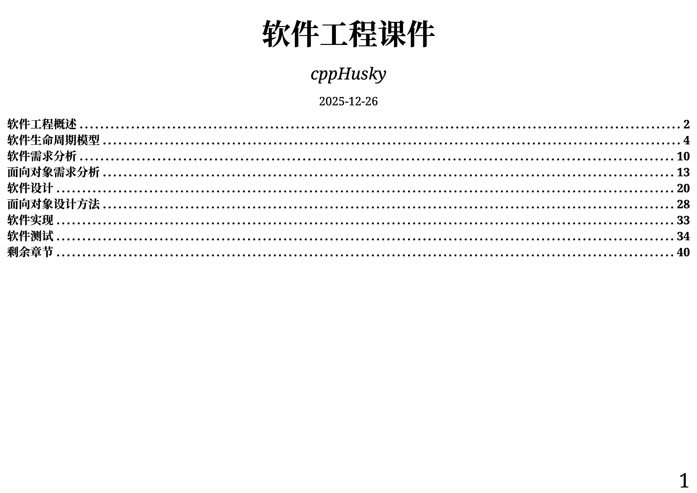
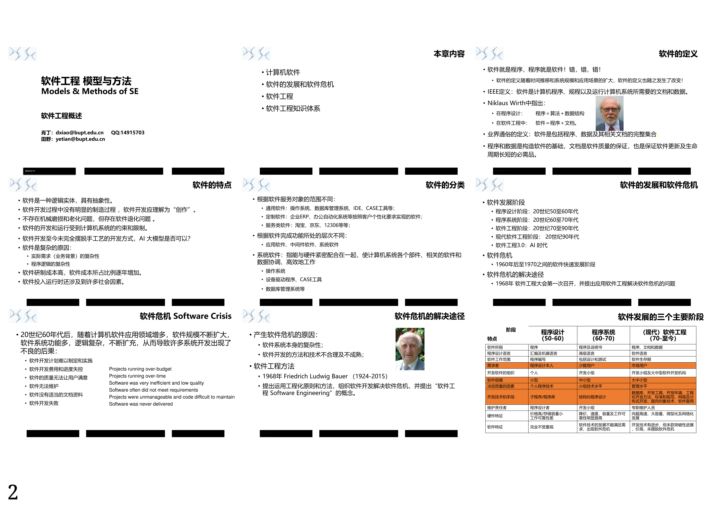

# OpenExamRef 开卷考试资料源（BYRDOCS）

本项目用于整理和组织适用于开卷考试的资料。每个 Branch 对应一门学科。

以下为范例：

> 
> 

如欲 Clone，可以只拷贝你需要的 Branch，例如：

```shell
git clone https://github.com/cppHusky/OpenExamRef.git --single-branch --branch 脑与认知科学
```

如欲提交 PR，请在对应科目名的 Branch 下进行，如 [脑与认知科学](https://github.com/cppHusky/OpenExamRef/tree/%E8%84%91%E4%B8%8E%E8%AE%A4%E7%9F%A5%E7%A7%91%E5%AD%A6)。

## 构建方法

需要安装以下依赖：

- [Typst CLI](https://typst.app)
- [GNU Make](https://www.gnu.org/software/make/)

准备好 PDF 格式的所需资料。如果是 PPT，请先将其导出为 PDF。

自行编写 `main.typ`，格式可参考其它 Branch。编写完成后，运行如下命令：

```shell
make
```
